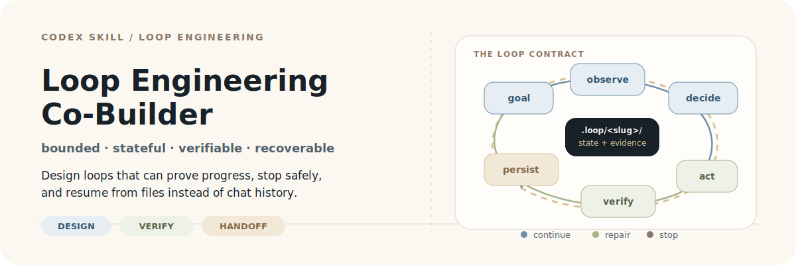
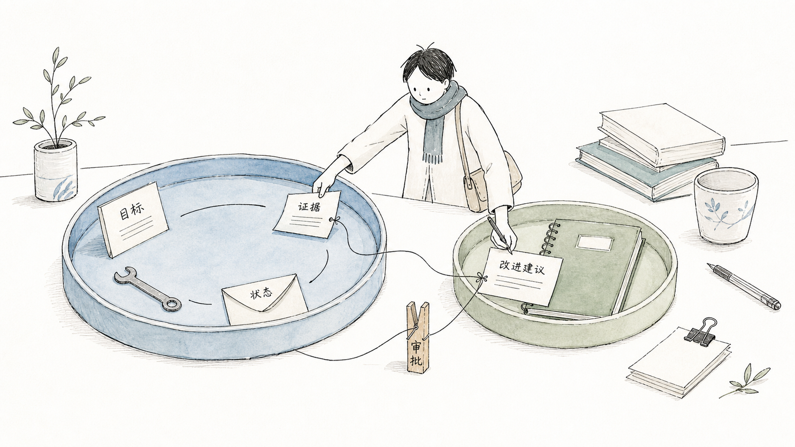

# Loop Engineering Co-Builder

> Build agent loops that can prove progress, stop safely, and resume without reconstructing the chat.

<p align="center">
  
</p>

<p align="center">
  <a href="#中文说明">中文说明</a> ·
  <a href="#install">Install</a> ·
  <a href="#choose-a-mode">Choose a mode</a> ·
  <a href="docs/design-notes.md">Design notes</a> ·
  <a href="LICENSE">MIT</a>
</p>

## What this is

`loop-engineering-co-builder` is a Codex Skill for turning repeatable or long-running Agent work into a bounded, stateful, verifiable workflow.

It treats a loop as an engineered control system—not as the same prompt repeated until the model sounds confident:

| The workflow needs to answer | The Skill makes it explicit |
| --- | --- |
| What is the Agent trying to accomplish? | A concrete goal, scope, inputs, outputs, and acceptance criteria |
| Has the work actually moved forward? | Observable state, evidence, and independent verification |
| What may the Agent do next? | Phase-specific tools, permissions, budgets, and stop conditions |
| Can another Agent resume it? | Project-local checkpoints, evidence, and a usable handoff |
| How should the workflow improve? | A reviewable improvement proposal, not silent self-modification |

The Skill owns the loop contract. It does not replace your model client, scheduler, sandbox, test suite, or runtime.

## The core loop

```text
goal -> observe -> decide -> act -> verify -> persist -> continue | repair | stop
```

Verification is part of the control loop: its evidence must be able to change the next decision. A repeated prompt without feedback is repetition, not engineering.


## Keep task execution separate from improvement

Every Loop Engineering project has two related but different loops:

1. **Task loop** — advances the user's concrete goal within a finite budget and explicit permissions.
2. **Improvement loop** — studies failure evidence and proposes changes to the loop design; it does not automatically edit the Skill, `AGENTS.md`, permissions, persistent memory, or production configuration.



This separation prevents a blocked task from weakening the rules that are supposed to control it.

## Install

### Option A: Skills CLI

If your environment provides the Skills CLI:

```bash
npx skills add 2023Anita/loop-engineering-co-builder
```

### Option B: Copy the Skill directory

```bash
git clone https://github.com/2023Anita/loop-engineering-co-builder.git
cp -R loop-engineering-co-builder/skills/loop-engineering-co-builder ~/.codex/skills/
```

Reload Codex, then invoke it explicitly:

```text
Use $loop-engineering-co-builder to turn this goal into a bounded, stateful, verifiable agent loop.
```

## Initialize and verify a loop

Start with `design` for a new workflow. The initializer creates the contract and checkpoint files; it does not mean the plan has been approved or executed.

```bash
python3 ~/.codex/skills/loop-engineering-co-builder/scripts/init_loop.py \
  "Repair one flaky API test" \
  --root "/path/to/project" \
  --slug "repair-flaky-api-test"
```

After editing the generated contract and completing a bounded iteration, validate the artifact set:

```bash
python3 ~/.codex/skills/loop-engineering-co-builder/scripts/validate_loop.py \
  "/path/to/project/.loop/repair-flaky-api-test"
```

## Choose a mode

| Mode | Use it to | Default boundary |
| --- | --- | --- |
| `design` | Define the goal, state, tools, permissions, acceptance, and stop rules | Creates or revises the contract; does not execute the task |
| `run` | Execute one bounded task iteration | Persists state after the iteration |
| `verify` | Check the current output against independent evidence | Does not replace evidence with self-evaluation |
| `repair` | Diagnose a failure and make the smallest justified correction | Does not expand permissions to hide the failure |
| `improve` | Propose a change to the loop design | Writes a proposal; does not apply durable changes automatically |

## What gets persisted

Each loop lives under `.loop/<slug>/` so a new Agent or human can resume without reconstructing the chat:

```text
.loop/<slug>/
├── loop-spec.md
├── state.json
├── verification-report.md
├── handoff.md
├── retrospective.md
├── improvement-proposal.md
└── evidence/
```

| Artifact | Answers |
| --- | --- |
| `loop-spec.md` | What the loop is allowed to do and how success is defined |
| `state.json` | Where the loop is, what changed, and what should happen next |
| `verification-report.md` | Which acceptance criteria passed, failed, or are blocked |
| `handoff.md` | How another Agent can resume in under five minutes |
| `retrospective.md` | What was learned from the observed run |
| `improvement-proposal.md` | Which durable design change is proposed, with risk and rollback |
| `evidence/` | The raw files, logs, screenshots, or other proof behind the decision |

## Safety and truthful stopping

The Skill distinguishes allowed actions, approval-required actions, and denied actions. Destructive edits, production writes, external messages, publication, credential changes, repository visibility changes, `git commit`, and `git push` remain behind explicit approval gates.


Completion is evidence-gated. Reaching an iteration limit, producing a plausible artifact, or exhausting context is not success:

- `completed` requires persisted state and passing verification evidence;
- `blocked` means a required decision, permission, or dependency is missing;
- `failed` means the loop cannot satisfy its contract with the current strategy;
- `budget_exhausted` means the finite budget ended before completion.

The correct terminal state is part of the result.

## Recovery and handoff

`state.json` is an operational checkpoint, not a chat diary. It keeps the facts needed for the next decision; detailed logs stay in `evidence/`.

`handoff.md` records the current status, completed and pending criteria, last verification, blocker, required approval, exact next action, and the command needed to resume or validate the loop.


## Good fit—and a poor fit

Use this Skill when the work is repeatable or long-running, has observable intermediate state, has a meaningful verifier, and benefits from retry or resumption. Examples include:

- code repair with reproducible tests;
- evidence-based research with traceable sources;
- content production with review and publication gates;
- release or migration preparation with explicit checkpoints.

Use a direct workflow instead for a one-step answer, open-ended exploration without a useful feedback signal, or an operation where retrying would amplify risk.

## Design notes and provenance

- [Skill instructions](skills/loop-engineering-co-builder/SKILL.md)
- [Design notes](docs/design-notes.md)
- [Core loop model](skills/loop-engineering-co-builder/references/core-loop-model.md)
- [Loop specification schema](skills/loop-engineering-co-builder/references/loop-spec-schema.md)
- [Permission and safety](skills/loop-engineering-co-builder/references/permission-and-safety.md)
- [Verification patterns](skills/loop-engineering-co-builder/references/verification-patterns.md)

The project was informed by a user-supplied bilingual subtitle of an Anthropic technical talk and official public material about agent loops. The raw subtitle is not redistributed. The repository contains an independent, provider-neutral engineering synthesis; it does not claim command-level equivalence between Codex and other runtimes.

## 中文说明

`loop-engineering-co-builder` 是一个面向 Codex 的工程化 Skill：把“让 Agent 一直循环直到完成”变成一个有边界、有状态、可验证、可恢复的控制系统。

它要求每次循环都能回答：目标是什么、当前状态在哪里、下一步允许做什么、什么证据能证明进展、什么时候必须停止，以及另一个 Agent 如何接手。

### 核心模型

```text
目标 → 观察 → 决策 → 执行 → 验证 → 持久化 → 继续 | 修复 | 停止
```

项目明确区分两个循环：任务循环推进当前目标；改进循环根据失败证据提出设计变更，但默认不自动修改 Skill、`AGENTS.md`、权限、长期记忆或生产配置。

每个项目使用 `.loop/<slug>/` 保存 `loop-spec.md`、`state.json`、`verification-report.md`、`handoff.md`、`retrospective.md`、`improvement-proposal.md` 和 `evidence/`，让新的 Agent 可以从文件状态恢复，而不是重读整段聊天。

### 五种模式

`design` 定义契约；`run` 执行一轮有边界的任务；`verify` 用独立证据检查结果；`repair` 做最小修复；`improve` 生成需要审批的循环改进提案。

### 安全边界

删除、生产写入、外部发送、正式发布、凭证或权限变更、仓库可见性变更，以及 `git commit` / `git push` 默认需要明确授权。达到最大迭代次数不等于成功；无法继续时应诚实报告 `blocked`、`failed` 或 `budget_exhausted`。

### 最短使用路径

安装 Skill 后，先用 `design` 设计目标、验收标准、权限和停止条件，再用 `init_loop.py` 初始化 `.loop/<slug>/`，最后用 `validate_loop.py` 和领域测试检查结果。

## License

[MIT](LICENSE)
